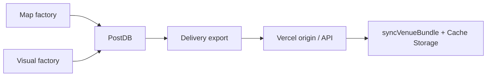

# Spec — factories → app end-state

**Effort:** `factories-to-app`  
**Status:** Complete — PR stack merge pending  
**Supersedes:** GitHub #625–630  
**Canon:** ADR-0024 (PostDB bus) · ADR-0025 (module seams) · ADR-0018 (delivery) · `scripts/lib/operating-stack.json`

---

## Problem (resolved)

The **Map factory** and **Visual factory** build and certify Worlds; Trains H/I shipped the MapLibre renderer, banded bakes, and evidence lane. The phone no longer treats git seed files as the only runtime bus: PostDB exports revision-pinned bundles, the app proves delta sync and guest Train H behaviors in the browser vertical, and Delivery v1 architecture is signed off.

## Destination (shipped)

Factories publish versioned truth and display packs through **PostDB**; **Delivery** exports hash-verified bundles; the **Party app** consumes exported artifacts offline with `basedOn.revisionId` delta sync. Git holds builder inputs and code — not the authoritative factory head at scale.



**Phone contract (locked):** hash-verified manifest, truth/display split, `planBundleSync` dedupe, atomic cache commit, `floor` vs `pyramid` sync scopes (ADR-0021 §5). See `apps/party-tracker/lib/venue/download.js`.

## Goals

| # | Goal | Status | Evidence |
|---|------|--------|----------|
| 1 | PostDB is the factory bus | ✅ | `venue_heads`, `postdb-io.mjs`, `DATABASE_URL` on factory verbs |
| 2 | Delivery export is the publish path | ✅ | `venues:export`, revision-pinned `*.bundle.json`, CI delivery leg |
| 3 | App proves delta sync E2E | ✅ | `/api/venues/:id/bundle?since=`, functional + `delivery-delta-sync` row |
| 4 | Guest Train H gaps ship | ✅ | Band crossfade (#714); opt-in offline pyramid (#716) |
| 5 | Vertical e2e | ✅ | `train-h-zoom-bands` + `train-h-offline-download` in `shipped`; pre-merge vertical green |
| 6 | Delivery architecture sign-off | ✅ | Ticket 19 — ADR-0024 Slice 1; R2 per `addVendorWhen` |

## Non-goals (unchanged)

- Trains H/I slices (built — do not reopen)
- Kings Island G1–G5 visual acceptance suite (separate effort; #700)
- Real-time PBR tier (ADR-0013 item 4 — deferred)
- Phase 8 generative fleet / Blender E.1
- Databricks Lakebase, Cloudflare R2/Workers, new vendors (`operating-stack.json` `park` / `doNotAdd`)
- Hand-editing generated `public/venues/*` (builder-app contract)

## As-built

| Layer | Shipped |
|-------|---------|
| Module seams | `map-factory/` · `visual-factory/` · `delivery/` (ADR-0025) |
| PostDB | `db/migrations/004*`, `postdb-io.mjs`, mirror sync |
| Export | `export-from-postdb.mjs`, `publishBundle`, `venues:export`, revision-pinned seed bundles |
| Delta sync | `delta-sync.mjs` (`DELTA_STATUS: live`), API route, `syncVenueBundle` revision cursor |
| Display schema gate | `display-schema-gate.mjs` (ticket 18) |
| App map | MapLibre + `createBandViewport` crossfade; scoped download manager |
| Guest offline | `OfflineParkDownload` — stated size, guest opt-in only |
| Tests | `delivery-export`, `delivery-delta`, `venue-download`, `functional.mjs` venues |

## Gaps closed (this epic)

| Gap | Ticket | Evidence |
|-----|--------|----------|
| Seed bundles lack `basedOn.revisionId` | 16 | All flagship `*.bundle.json` carry `revisionId` |
| PostDB export not gated in pre-merge vertical | 16 | Delivery leg runs against `postgres:16` |
| Delta sync not proven in browser vertical | 17 | Functional check + `delivery-delta-sync` |
| Band boundary UX | 20 | `train-h-zoom-bands` in `shipped` |
| Offline pyramid download UI | 21 | `train-h-offline-download` in `shipped` |
| Delivery architecture sign-off | 19 | ADR-0024 Slice 1; R2 deferred per `addVendorWhen` |

## Open — merge only

| Item | Action |
|------|--------|
| PR stack | Merge #711 → #712 → #714 → #716 to `main` |

## Ticket ledger

```
15 (resolved) → 16 (resolved) → 17 (resolved) → 20, 21 (resolved)
18 (resolved, parallel)
19 (resolved)
```

| # | Title | Status |
|---|-------|--------|
| 15 | PostDB Slice 1 | resolved |
| 16 | Delivery export closeout | resolved |
| 17 | Delta sync E2E in app | resolved |
| 18 | Display-schema CI gate | resolved |
| 19 | Delivery closeout grill | resolved |
| 20 | Band crossfade critical path | resolved |
| 21 | Offline pyramid download UI | resolved |

## PR stack (merge order)

1. #711 — ticket 16 (base: `main`) — **MERGEABLE**
2. #712 — ticket 17 (base: ticket-16)
3. #714 — ticket 20 (base: ticket-17)
4. #716 — ticket 21 (base: ticket-20)

## Acceptance (epic done)

- [x] Tickets 16–21 **resolved**
- [x] Flagship venues export from PostDB with `revisionId` in seed bundles
- [x] `critical-paths.json`: `train-h-zoom-bands` and `train-h-offline-download` in `shipped`
- [x] `npm run test:pre-merge-vertical` green on epic branch (pre-push)
- [ ] PR stack merged to `main`

## References

- `CONTEXT.md` — Factory vocabulary
- `docs/adr/0024-postdb-factory-bus.md` · `docs/adr/0025-factory-module-seams.md` · `docs/adr/0018-factory-interaction-and-delivery.md` · `docs/adr/0021-zoomable-worlds-revised.md`
- `docs/research/2026-08-24-factory-industry-comparison.md` — delivery options (P3 R2 deferred)
- `docs/agents/policies/builder-app-contract.md` · `docs/agents/policies/matt-workflow.md`
- `test/app/critical-paths.json`
