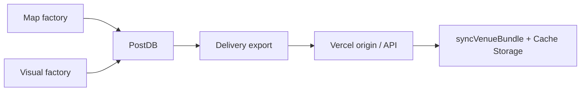

# Spec — factories → app end-state

**Effort:** `factories-to-app`  
**Status:** Ready for `/to-tickets` → `/implement`  
**Supersedes:** GitHub #625–630  
**Canon:** ADR-0024 (PostDB bus) · ADR-0025 (module seams) · ADR-0018 (delivery) · `scripts/lib/operating-stack.json`

---

## Problem

The **Map factory** and **Visual factory** can build and certify Worlds, and Trains H/I shipped the MapLibre renderer, banded bakes, and evidence lane. The phone still treats git seed files under `apps/party-tracker/public/venues/` as the de-facto runtime bus. PostDB Slice 1 and delivery export code (#667) exist, but production export, revision-pinned seed bundles, and two guest-facing Train H behaviors are not closed in the app vertical.

## Destination

Factories publish versioned truth and display packs through **PostDB**; **Delivery** exports hash-verified bundles; the **Party app** consumes exported artifacts offline with `basedOn.revisionId` delta sync. Git holds builder inputs and code — not the authoritative factory head at scale.



**Phone contract (locked):** hash-verified manifest, truth/display split, `planBundleSync` dedupe, atomic cache commit. See `apps/party-tracker/lib/venue/download.js`.

## Goals

1. **PostDB is the factory bus** — `DATABASE_URL` required for factory verbs; `venue_heads` is the promotable World head.
2. **Delivery export is the publish path** — `npm run venues:export` writes revision-pinned `.bundle.json` + blob registry; CI freshness uses `basedOn.revisionId`.
3. **App proves delta sync E2E** — cached bundle carries `revisionId`; app hits `/api/venues/:id/bundle?since=` and merges deltas.
4. **Guest Train H gaps ship** — band crossfade + pitch staging; opt-in offline pyramid download with stated size (ADR-0021 §5).
5. **Vertical e2e** — `npm run test:pre-merge-vertical` green; new rows in `test/app/critical-paths.json` for the two guest paths.

## Non-goals (this epic)

- Trains H/I slices (built — do not reopen)
- Kings Island G1–G5 visual acceptance suite (separate effort; #700)
- Real-time PBR tier (ADR-0013 item 4 — deferred)
- Phase 8 generative fleet / Blender E.1
- Databricks Lakebase, Cloudflare R2/Workers, new vendors (`operating-stack.json` `park` / `doNotAdd`)
- Hand-editing generated `public/venues/*` (builder-app contract)

## As-built (do not re-litigate)

| Layer | Shipped |
|-------|---------|
| Module seams | `map-factory/` · `visual-factory/` · `delivery/` (ADR-0025) |
| PostDB | `db/migrations/004*`, `postdb-io.mjs`, mirror sync |
| Export | `export-from-postdb.mjs`, `publishBundle`, `venues:export` |
| Delta sync | `delta-sync.mjs` (`DELTA_STATUS: live`), API route, `syncVenueBundle` revision cursor |
| Display schema gate | `display-schema-gate.mjs` (ticket 18) |
| App map | MapLibre shipped (h18); download manager (Train F) |
| Tests | `test/builder/delivery-export.mjs`, `delivery-delta.mjs`, `venue-download.test.mjs` |

## Gaps (this epic closes)

| Gap | Ticket | Evidence of done |
|-----|--------|------------------|
| Seed bundles lack `basedOn.revisionId` | 16 | All flagship `*.bundle.json` carry revision; export in CI/release path |
| PostDB export not gated in pre-merge vertical | 16 | Delivery leg runs `delivery-export` with `DATABASE_URL` in CI |
| Delta sync not proven in browser vertical | 17 | ✅ Functional check + `delivery-delta-sync` critical-path row |
| Band boundary UX | 20 | ✅ `train-h-zoom-bands` in `shipped` |
| Offline pyramid download UI | 21 | `train-h-offline-download` moves from `upcoming` → `shipped` |
| Delivery architecture sign-off | 19 | Owner grill resolved; map.md updated |

## Ticket sequence

Operating stack (`scripts/lib/operating-stack.json`):

```
15 (resolved) → 16 → 17 → 20, 21
18 (resolved, parallel)
19 (human grill, after 17)
```

| # | Title | Status | Blocked by |
|---|-------|--------|------------|
| 15 | PostDB Slice 1 | resolved | — |
| 16 | Delivery export closeout | ready-for-agent | 15 |
| 17 | Delta sync E2E in app | resolved | 16 |
| 18 | Display-schema CI gate | resolved | — |
| 19 | Delivery closeout grill | ready-for-human | 17 |
| 20 | Band crossfade critical path | resolved | 17 |
| 21 | Offline pyramid download UI | ready-for-agent | 17 |

## Implementation rules

- **Matt workflow:** `/implement` only when `npm run workflow:check -- --intent implement` passes.
- **Builder-app contract:** fix upstream; `venues:export` + `venues:report`; prove in browser — never hand-edit `public/venues/`.
- **Vertical e2e:** assert output, not exit codes — see `docs/agents/policies/vertical-e2e.md`.
- **Freshness:** `freshnessPinRevision` in `factory-validate.mjs`; bundles must pin `venue_heads.truth_revision_id`.
- **Operating stack:** Docker Postgres + CI `postgres:16` for factory; Vercel + Neon for hosted API; no new vendors without `addVendorWhen` trigger.

## Acceptance (epic done)

- [ ] Tickets 16, 17, 20, 21 **resolved**; ticket 19 **resolved** (human)
- [ ] Flagship venues export from PostDB with `revisionId` in seed bundles
- [ ] `npm run venues:factory-validate -- --all` green with `DATABASE_URL`
- [ ] `npm run test:pre-merge-vertical` green on epic branch
- [ ] `critical-paths.json`: `train-h-zoom-bands` and `train-h-offline-download` in `shipped`
- [ ] No agent merges claiming map/display correct without build + browser proof

## References

- `CONTEXT.md` — Factory vocabulary
- `docs/adr/0024-postdb-factory-bus.md` · `docs/adr/0025-factory-module-seams.md` · `docs/adr/0018-factory-interaction-and-delivery.md`
- `docs/research/2026-08-24-factory-industry-comparison.md` — delivery options (P3 R2 deferred)
- `docs/research/2026-08-19-display-pipeline-execution-plan.md` — phases 3/4/8 out of scope here
- `docs/agents/policies/builder-app-contract.md` · `docs/agents/policies/matt-workflow.md`
- `test/app/critical-paths.json` — `upcoming` rows 20/21 promote
