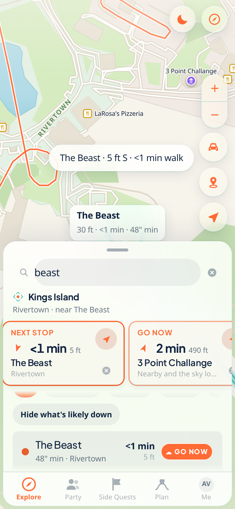
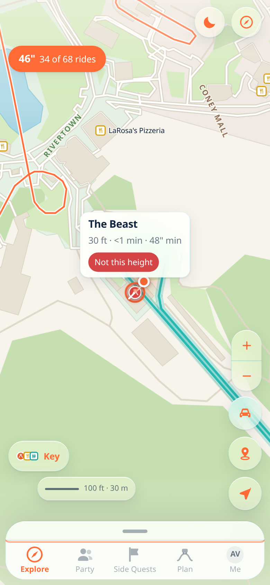
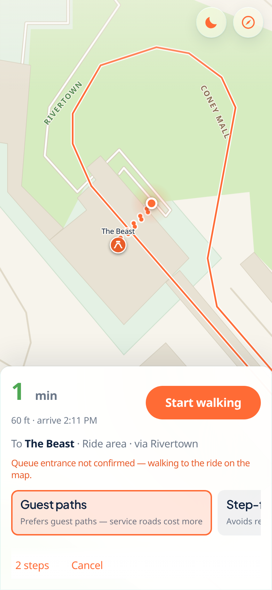

<p align="center">
  
</p>

<h1 align="center">Parkbound</h1>

<p align="center"><strong>Explore more. Stress less.</strong></p>

<p align="center">
  An explorer’s companion for a group at a big, crowded park — live party coordination,
  walking trails, and a drawn park map.
</p>

<p align="center">
  <a href="https://github.com/parthalon025/six-flags-sa/actions/workflows/test-app.yml"></a>
  <a href="https://github.com/parthalon025/six-flags-sa/blob/main/package.json"></a>
  <a href="LICENSE"></a>
  = 22" />
  
  
</p>

<p align="center">
  <a href="#walkthrough">Walkthrough</a> •
  <a href="#screenshots">Screenshots</a> •
  <a href="docs/guide/index.md">Documentation</a> •
  <a href="INSTALL.md">Install guide</a> •
  <a href="docs/architecture-map.md">Architecture</a> •
  <a href="#contributing">Contributing</a> •
  <a href="#license">License</a>
</p>

<p align="center">
  <a href="https://vercel.com/new/clone?repository-url=https%3A%2F%2Fgithub.com%2Fparthalon025%2Fsix-flags-sa"></a>
</p>

Parkbound ships with Kings Island, Six Flags Fiesta Texas, Cedar Point, and Big Kahuna's.
One command — or a form under Actions — builds a map of anywhere else OpenStreetMap covers.

## Walkthrough

Kings Island on a phone: the drawn map, a coaster tap, height filter, walking directions, and a live party.

<video src="docs/images/readme/walkthrough.mp4" poster="docs/images/readme/walkthrough-poster.png" width="390" controls muted playsinline>
  <a href="docs/images/readme/walkthrough.mp4">Watch the walkthrough (MP4)</a>
</video>

<p>
  <a href="docs/images/readme/walkthrough.mp4">Open the walkthrough video</a>
  ·
  <a href="docs/guide/walkthrough.md">Step-by-step examples</a>
</p>

1. **Drawn map** — SVG from OpenStreetMap, not tiles. Tracks, water, midways, named lands.
2. **Night palette** — same geometry, low-glare colours after dark.
3. **Tap a coaster** — that ride's track lights up; callout has walk time and height.
4. **Height filter** — one slider; rides that are out turn alarm red on the map.
5. **Walk me there** — on-phone route, time, arrival, Start walking.
6. **Live party** — another phone on the map with range and walking time.

Full captions: [docs/guide/walkthrough.md](docs/guide/walkthrough.md).

## Screenshots

<table>
  <tr>
    <td align="center" width="50%">
      
      <br /><strong>Drawn SVG map</strong><br />
      <sub>Real OpenStreetMap geometry — midways, water, buildings, and every coaster's track — not map tiles. <a href="docs/guide/features.md">Features</a></sub>
    </td>
    <td align="center" width="50%">
      
      <br /><strong>Night map</strong><br />
      <sub>Low-glare palette for after dark. Follows the phone until you pick one. <a href="docs/guide/features.md">Features</a></sub>
    </td>
  </tr>
  <tr>
    <td align="center" width="50%">
      
      <br /><strong>Tap a coaster</strong><br />
      <sub>The ride's own track lights up. Callout: name, walk time, height rule. <a href="docs/guide/features.md">Features</a></sub>
    </td>
    <td align="center" width="50%">
      
      <br /><strong>Height requirements</strong><br />
      <sub>One slider. Rides that are out today turn alarm red — ringed and struck through. <a href="docs/guide/features.md">Features</a></sub>
    </td>
  </tr>
  <tr>
    <td align="center" width="50%">
      
      <br /><strong>Walking directions</strong><br />
      <sub>Turn-by-turn on the phone from the venue file. No routing API, no key. <a href="docs/guide/walking-directions.md">Walking</a></sub>
    </td>
    <td align="center" width="50%">
      
      <br /><strong>Live party</strong><br />
      <sub>Range, bearing, and walking time for each person — hosted on a phone in the group. <a href="docs/guide/party.md">Party</a></sub>
    </td>
  </tr>
</table>

Stills and the video are regenerated with `npm run readme:shots` whenever the screens they show change — see [Contributing](docs/guide/contributing.md).

## Quick start

**[INSTALL.md](INSTALL.md)** is the guide for people who will use the app — no terminal required.

```bash
npm run phone        # builds, starts, tunnels, prints a QR — scan it
```

For development:

```bash
npm run setup        # checks Node, installs, builds
npm run dev          # http://localhost:3000
```

More detail: [Getting started](docs/guide/getting-started.md).

## Documentation

The long-form README now lives in linked guide pages under **[docs/guide/](docs/guide/index.md)**:

| Topic | Page |
| --- | --- |
| Walkthrough | [docs/guide/walkthrough.md](docs/guide/walkthrough.md) |
| Features | [docs/guide/features.md](docs/guide/features.md) |
| Walking directions | [docs/guide/walking-directions.md](docs/guide/walking-directions.md) |
| Party mesh | [docs/guide/party.md](docs/guide/party.md) |
| API | [docs/guide/api.md](docs/guide/api.md) |
| Venue builder | [docs/guide/venue-builder.md](docs/guide/venue-builder.md) |
| Tests | [docs/guide/testing.md](docs/guide/testing.md) |
| Privacy & data | [docs/guide/privacy.md](docs/guide/privacy.md), [docs/guide/data-sources.md](docs/guide/data-sources.md) |
| Store binaries | [fastlane/README.md](fastlane/README.md) |

**New to the codebase?** Start with the [architecture map](docs/architecture-map.md), then
[docs/guide/index.md](docs/guide/index.md).

## Contributing

Issues and pull requests: [GitHub](https://github.com/parthalon025/six-flags-sa/issues).
Read [Contributing](docs/guide/contributing.md) for the builder ↔ app contract, PR expectations,
and how to refresh README screenshots and the walkthrough video.

## License

[MIT](LICENSE) © 2026 Justin
