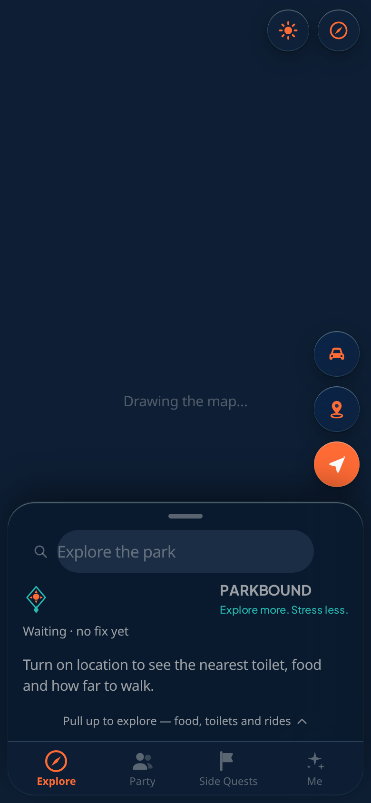
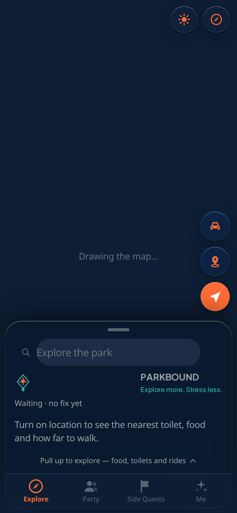
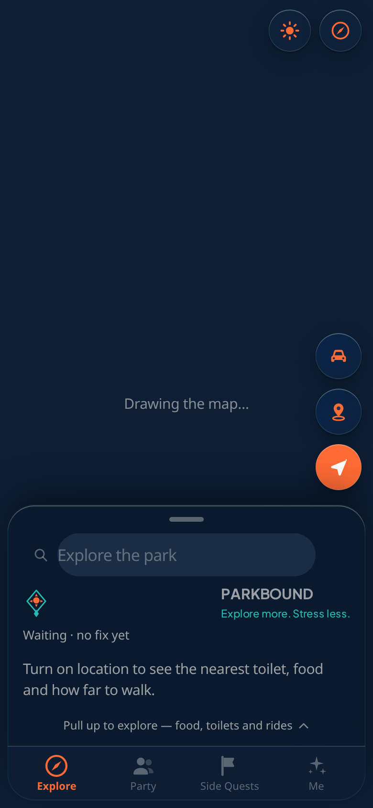
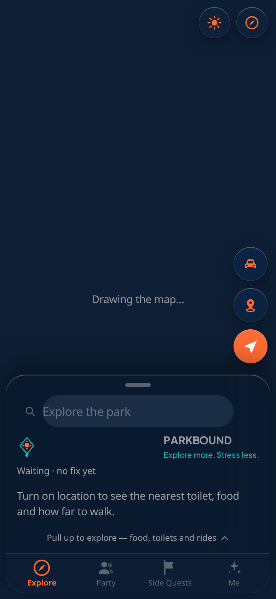

<p align="center">
  
</p>

<h1 align="center">Parkbound</h1>

<p align="center"><strong>Explore more. Stress less.</strong></p>

<p align="center">
  An explorer’s companion for a group at a big, crowded park — live party coordination,
  walking trails, and a drawn park map.
</p>

<p align="center">
  <a href="https://github.com/parthalon025/six-flags-sa/actions/workflows/test-app.yml"></a>
  <a href="https://github.com/parthalon025/six-flags-sa/blob/main/package.json"></a>
  <a href="LICENSE"></a>
  = 22" />
  
  
</p>

<p align="center">
  <a href="#screenshots">Screenshots</a> •
  <a href="docs/guide/index.md">Documentation</a> •
  <a href="INSTALL.md">Install guide</a> •
  <a href="docs/architecture-map.md">Architecture</a> •
  <a href="#contributing">Contributing</a> •
  <a href="#license">License</a>
</p>

<p align="center">
  <a href="https://vercel.com/new/clone?repository-url=https%3A%2F%2Fgithub.com%2Fparthalon025%2Fsix-flags-sa"></a>
</p>

## Screenshots

<p align="center">
  
  
  
  
</p>

<p align="center"><em>Drawn SVG maps, a glance rail with walking times, and live party coordination — Kings Island shown.</em></p>

Parkbound ships with Kings Island, Six Flags Fiesta Texas, Cedar Point, and Big Kahuna's.
One command — or a form under Actions — builds a map of anywhere else OpenStreetMap covers.
See **[Features](docs/guide/features.md)** for the full capability list.

## Quick start

**[INSTALL.md](INSTALL.md)** is the guide for people who will use the app — no terminal required.

```bash
npm run phone        # builds, starts, tunnels, prints a QR — scan it
```

For development:

```bash
npm run setup        # checks Node, installs, builds
npm run dev          # http://localhost:3000
```

More detail: [Getting started](docs/guide/getting-started.md).

## Documentation

The long-form README now lives in linked guide pages under **[docs/guide/](docs/guide/index.md)**:

| Topic | Page |
| --- | --- |
| Features | [docs/guide/features.md](docs/guide/features.md) |
| Walking directions | [docs/guide/walking-directions.md](docs/guide/walking-directions.md) |
| Party mesh | [docs/guide/party.md](docs/guide/party.md) |
| API | [docs/guide/api.md](docs/guide/api.md) |
| Venue builder | [docs/guide/venue-builder.md](docs/guide/venue-builder.md) |
| Tests | [docs/guide/testing.md](docs/guide/testing.md) |
| Privacy & data | [docs/guide/privacy.md](docs/guide/privacy.md), [docs/guide/data-sources.md](docs/guide/data-sources.md) |

**New to the codebase?** Start with the [architecture map](docs/architecture-map.md), then
[docs/guide/index.md](docs/guide/index.md).

## Contributing

Issues and pull requests: [GitHub](https://github.com/parthalon025/six-flags-sa/issues).
Read [Contributing](docs/guide/contributing.md) for the builder ↔ app contract, PR expectations,
and how to refresh README screenshots.

## License

[MIT](LICENSE) © 2026 Justin
