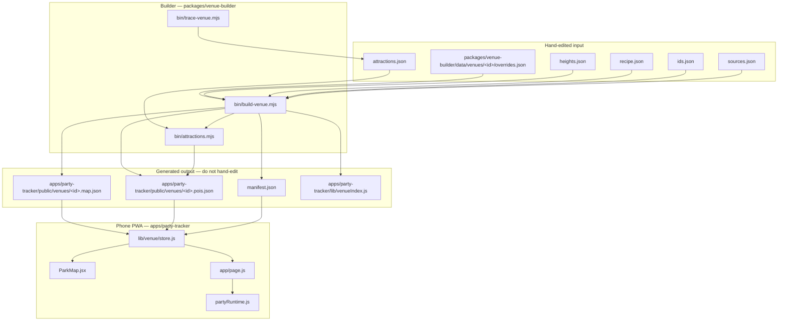
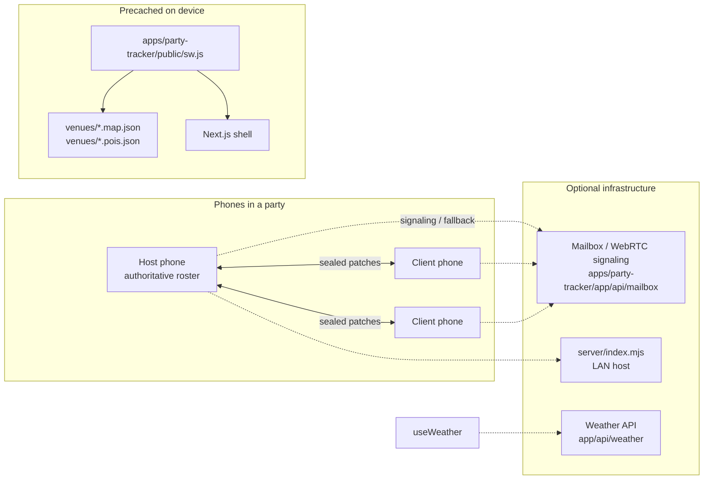
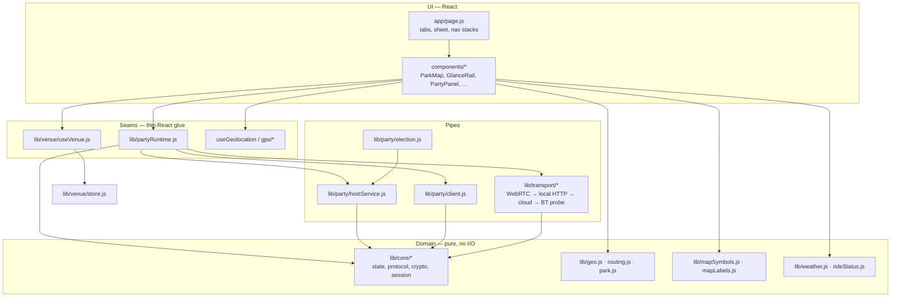
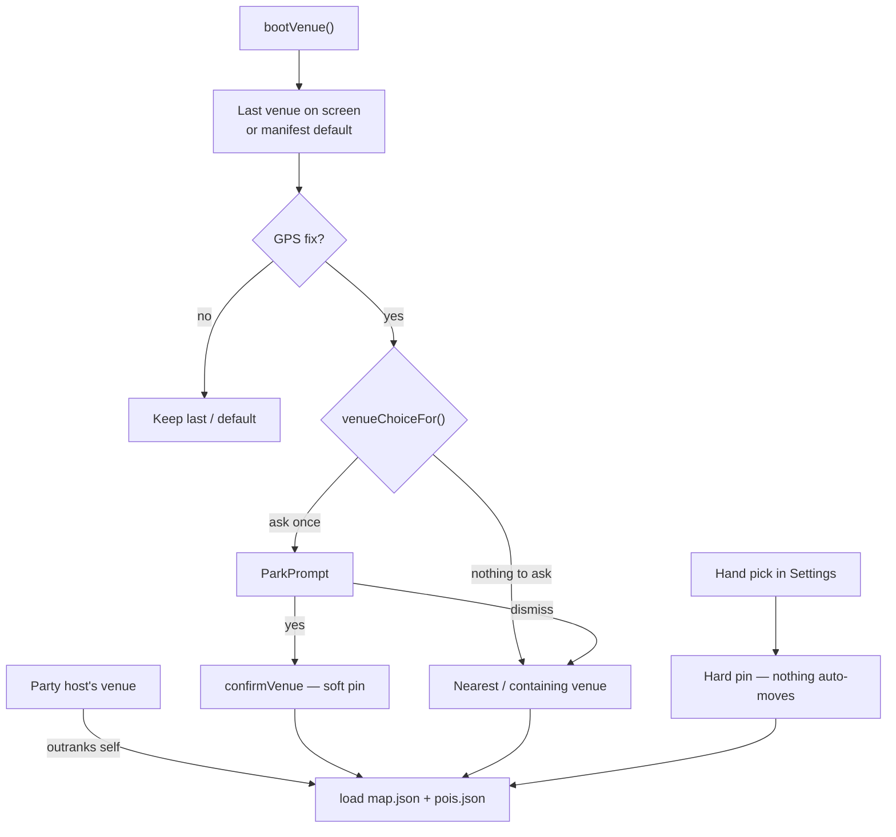
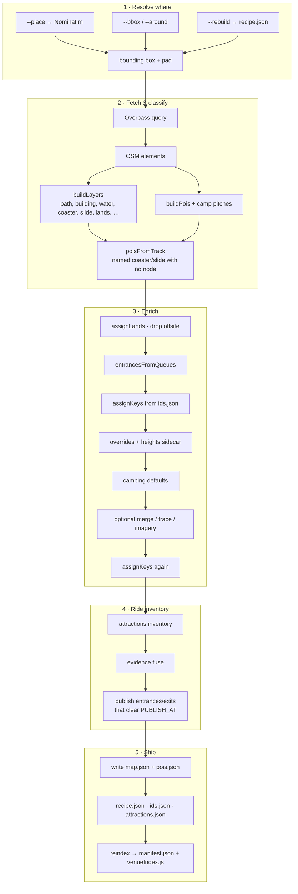
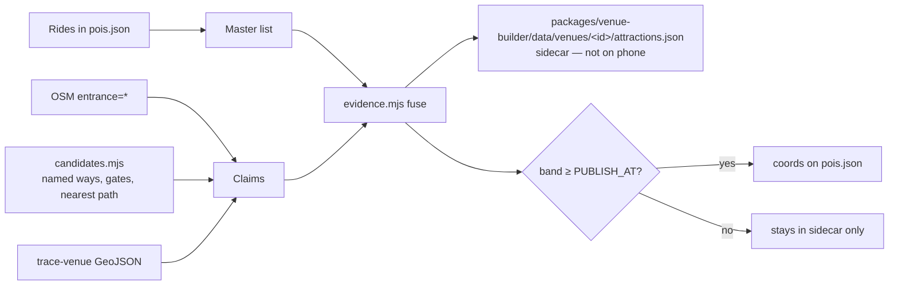
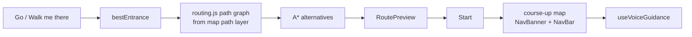

# Architecture map — Park Bound

A visual tour for new developers. Read this before diving into files.
Short tree: [docs/repo-structure.md](./repo-structure.md). Package seams: [packages/README.md](../packages/README.md).
Adapter / evidence detail: [universal venue builder architecture](./universal-venue-builder-architecture.md).

---

## The one idea

Two runtimes, one contract:

| Runtime | Lives in | May use the network? | Ships to phones? |
| --- | --- | --- | --- |
| **Builder** | `packages/venue-builder/` | Yes — Overpass, Nominatim, research | No |
| **Phone (PWA)** | `apps/party-tracker/` | Optional — party mesh, weather | Yes |

The builder writes JSON. The phone fetches JSON. Nothing in the phone imports
builder code, LangGraph, Valhalla, or YOLO.



**Rule of thumb:** wrong ride / height / tag → fix `packages/venue-builder/data/venues/` or `packages/venue-builder/lib/`,
then regenerate. Never patch `apps/party-tracker/public/venues/*.json` by hand.

---

## System map — what talks to what



Party state lives on the **host phone**. Relays move sealed blobs; they never
hold the AES key (that rides in the invite URL fragment). The map and POIs work
offline after the first open — the service worker caches them; the roster never
goes in that cache.

---

## Phone app — layers

Paths in this section are under `apps/party-tracker/`. Shared contracts (`ontology`, `wayFlags`, `mapSymbols`) live in `packages/shared/` and are re-exported from `lib/`.



| Start here | Why |
| --- | --- |
| `app/page.js` | Owns tabs, sheet budget, what the map is asked to draw |
| `components/ParkMap.jsx` | SVG renderer: pan/zoom, markers, labels, route ink |
| `lib/venue/store.js` | Which venue is loaded and how it was chosen |
| `lib/partyRuntime.js` | Only bridge from React into host/client/transports |
| `lib/routing.js` | Path graph + A* turn-by-turn on the phone |
| `lib/core/state.js` | Party model and op reducer |

---

## Venue selection at boot



Priority when several answers compete: **hand pick → host venue → confirmed →
GPS inside/nearest → manifest default**.

---

## Pipeline visual — building a venue

`npm run venues:build` is the main path. `--rebuild` replays `recipe.json`.
Attractions inventory runs at the end of a full build.



### Inputs vs outputs

```text
packages/venue-builder/data/venues/<id>/   ← edit these (one package per venue)
        │
        ▼  npm run venues:build | rebuild | overrides | attractions
        │
apps/party-tracker/public/venues/<id>.map.json  ← generated (geometry layers)
apps/party-tracker/public/venues/<id>.pois.json ← generated (places + published entrances)
apps/party-tracker/public/venues/manifest.json  ← generated
apps/party-tracker/lib/venueIndex.js            ← generated (API route static imports)
```

### Companion scripts

| Script | Role |
| --- | --- |
| `venues:build` / `rebuild` | OSM → map + pois + recipe |
| `venues:attractions` | Entrances/exits evidence → publish into pois |
| `venues:trace` | Georeference a park PDF/map → features |
| `venues:overrides` | Re-apply overrides without refetching OSM |
| `venues:reindex` | Manifest + index only |
| `venues:report` | Checklist of what a venue carries |
| `venues:audit` / `research` | Gaps, briefs, capability hints |

---

## Attractions / evidence pipeline

A ride is not one point. The inventory finds **queue entrances and exits**,
scores each claim, and only publishes what clears the bar.



Weights and source keys live in `packages/venue-builder/lib/evidence.mjs`. Adapter wraps that
emit claims without becoming phone dependencies are documented in
[universal-venue-builder-architecture.md](./universal-venue-builder-architecture.md).

---

## Party mesh — how phones agree

```mermaid
sequenceDiagram
  participant Host as Host phone
  participant Relay as Mailbox optional
  participant Peer as Client phone

  Host->>Host: mint party key + code
  Host->>Peer: QR / invite fragment carries key
  Peer->>Relay: signaling / claim code
  Relay->>Host: introduce peers
  Host->>Peer: WebRTC data channel preferred
  Note over Host,Peer: All payloads AES-GCM sealed;<br/>relay never has the key
  Host->>Peer: PATCH_MEMBER / LOCATION / SET_MEET
  Peer->>Host: commands + location
  Note over Host,Peer: If host leaves, election.mjs<br/>promotes best remaining phone
```

Transport preference (failover): **WebRTC → local HTTP → cloud relay →
Bluetooth capability probe**. See `apps/party-tracker/lib/transport/registry.js`.

---

## Request path — walking directions



Routing runs **on the phone** against the venue's path geometry. Builder-side
route QA (`venues:route-qa`) is optional validation, not the runtime engine.

---

## API surface (when a server is up)

Most of the app is client-side. API routes exist for the optional cloud/LAN
fallback and a few soft services:

| Area | Path | Notes |
| --- | --- | --- |
| Party mailbox | `/api/mailbox/*` | Sealed blob relay + signaling |
| Party REST | `/api/party`, `/members`, `/location`, … | Cloud fallback store |
| Weather | `/api/weather` | Only routine outbound call; cached, fails soft |
| Health | `/api/health`, `/api/ready`, `/api/metrics` | Ops |
| Rides / status | `/api/rides`, `/api/ride-status` | Server-visible ride helpers |

Self-host everything with `npm run sync` (`server/index.mjs`) or Docker.

---

## Where to change what

| You want to… | Edit | Then |
| --- | --- | --- |
| Fix a height / alias / district tint | `packages/venue-builder/data/venues/<id>/overrides.json` or `heights.json` | `venues:overrides` or rebuild |
| Fix tag → layer/category mapping | `packages/venue-builder/lib/osm-tags.mjs` | rebuild affected venues |
| Fix fusion / publish threshold | `packages/venue-builder/lib/evidence.mjs` | `venues:attractions` |
| Change map drawing / symbols | `apps/party-tracker/components/ParkMap.jsx`, `packages/shared/mapSymbols.js` | app tests |
| Change party protocol | `apps/party-tracker/lib/core/*`, `lib/party/*` | unit + functional tests |
| Change sheet / tabs UX | `apps/party-tracker/app/page.js`, `lib/sheet.js` | UX / visual tests |
| Add a whole new park | Actions → Build a venue, or `venues:build` | report + PR |

---

## Suggested first hour

1. `npm run setup` (or install + `npm test:unit`) — see [INSTALL.md](../INSTALL.md).
2. Skim this map, then [packages/README.md](../packages/README.md) and [repo-structure.md](./repo-structure.md).
3. Open `apps/party-tracker/public/venues/manifest.json` and one `*.pois.json` — that is what the phone sees.
4. Trace one tap: place card → `bestEntrance` → `routing.js` → `ParkMap` route layer.
5. Trace one party message: `partyRuntime` → `seal` → transport → `hostService` / `client`.
6. Rebuild one small venue dry-run: `npm run venues:rebuild -- big-kahunas --dry-run`.

---

## Related docs

- [README — Building a map of somewhere else](../README.md#building-a-map-of-somewhere-else)
- [Packages — deep-module seams](../packages/README.md)
- [Repository structure](./repo-structure.md)
- [Universal venue builder architecture](./universal-venue-builder-architecture.md)
- [Dependency / adapter matrix](./universal-venue-builder-dependency-matrix.md)
- [Self-contained party handoff](./HANDOFF-self-contained.md)
- [App updates](./app-updates.md)
