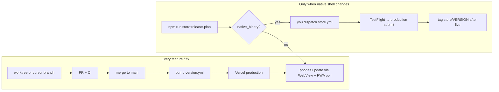

# Release cycle — how you actually ship

[← Guide index](index.md) · [Store tiers](store-releases.md) · [App updates](../app-updates.md)

Park Bound does **not** run on a calendar release train. You ship **web continuously** by merging PRs; the **App Store binary** is a rare, manual step when the native shell changes.

## The loop you already use



| Step | What happens | You do |
|------|----------------|--------|
| **1. Build** | Agent or you work in `worktree-*` / `cursor/*` branch | `npm run worktree:create -- <slug>` |
| **2. Validate** | Touch-only CI on PR; vertical before merge | `npm run test:pre-merge-vertical` |
| **3. Merge** | PR lands on `main` | Merge when green |
| **4. Version** | `bump-version.yml` patches/minors from PR title (`feat:`, `fix:`) | Tag PR title — **do not** bump version in the branch |
| **5. Deploy** | Vercel builds production when app paths changed | Nothing — no preview unless you directed one |
| **6. Users** | Capacitor loads `parkbound.kurat0r.ai`; PWA polls `/api/version` | Smoke production URL or store app after merge |

That is the release cycle for **99% of work**. No App Store review. No `store.yml`.

## Three lanes (different triggers)

| Lane | Trigger | Automation | Review? |
|------|---------|------------|---------|
| **Web** | Merge PR to `main` | `bump-version.yml` + Vercel | No |
| **Metadata** | Push `fastlane/metadata/**` to `main` | `ios-app-store-metadata.yml` | Light; no new IPA |
| **Native binary** | **You** run Actions → **Store binaries** | `store.yml` (`workflow_dispatch`) | Yes (App Store production) |

See [store-releases.md](store-releases.md) for tier checklists.

## When to touch the store

**Do not** upload a new IPA for every `main` merge. Semver on `main` can move several times a day (`1.11.8` → `1.12.1` in one week) while the store shell stays unchanged — that is correct.

Upload a store binary **only when**:

- `ios/`, `android/`, or `capacitor.config.json` changed since your last `store/*` tag, **and**
- You are ready to wait on Apple review.

Check anytime:

```bash
npm run store:release-cycle
npm run store:release-plan -- --base $(git tag -l 'store/*' --sort=-v:refname | head -1)
```

### Pre-launch (current state)

You have not tagged a `store/*` release yet. Finish [`SUBMISSION.md`](../../fastlane/metadata/ios/SUBMISSION.md), then:

1. **Actions → Store binaries** → `ios` → `beta` (TestFlight)
2. Device-test location, push, invites, Profile IAP sandbox
3. **Store binaries** → `production` when satisfied
4. After live: `git tag -a store/<version> -m "Store <version>" && git push origin store/<version>`

### After first store release

1. Keep merging web PRs — store users get those changes without a new binary.
2. When `store:release-plan` shows **native_binary** since last `store/*` tag:
   - Batch native work if you can (one review cycle per plugin bump).
   - TestFlight `beta` → QA → `production` when ready.
   - Tag `store/<version>` after both stores are live.

## Metadata (listing copy)

- Edit `fastlane/metadata/ios/en-US/` (screenshots: `npm run store:screenshots`).
- Push to `main` — metadata workflow uploads automatically.
- Or **Actions → iOS App Store metadata** without a Mac build.
- Refresh `release_notes.txt` to match the Connect version you are shipping.

## Hotfixes

| Layer | Action |
|-------|--------|
| **Web / API bug** | PR → merge → production. Fastest path. |
| **Native shell bug** | Fix on branch → merge → `store.yml` beta → expedited review only if production-critical |

## What we deliberately avoid

- **Calendar release trains** — you ship when PRs are ready, not on the last Thursday of the month.
- **Store upload per semver bump** — version on `main` tracks merged work; store binary tracks native shell.
- **Vercel previews for validation** — local build + CI; previews only when you direct (`[vercel build]`).
- **Version bumps in feature PRs** — `main` owns stamps after merge ([app-updates.md](../app-updates.md)).

## Post-deploy smoke (#443)

After production deploy (or when validating a URL by hand), run the full-stack readiness gate:

```bash
npm run deploy:post-check -- --url https://parkbound.kurat0r.ai
```

The script exits non-zero with a per-check report when anything fails:

| Check | What it proves |
|-------|----------------|
| `/api/ready` | Configured backends answer (Redis, Postgres when probed, Clerk keys) |
| `schema_migrations` | Deployed Postgres ledger matches `db/migrations/*.sql` in this repo (`DATABASE_URL` required) |
| `/api/webhooks/clerk` | Webhook route is mounted (verification failure is OK; 404 is not) |

Set `POST_DEPLOY_URL` instead of `--url` in CI. Use `--skip-migrations` when Postgres is not reachable from the runner (readiness + webhook only). On legacy databases, run `npm run postdb:migrate` once to backfill `schema_migrations` before the migration check can pass.

Run manually after merge as the post-deploy checklist, or wire into a post-deploy workflow when production credentials are available.

## Commands

| Command | Purpose |
|---------|---------|
| `npm run store:release-cycle` | Current mode + checklist for how you work |
| `npm run version:matrix` | Repo vs Vercel vs stores (also on every merge to `main`) |
| `npm run store:release-plan` | Classify paths: web vs metadata vs native |
| `npm run test:pre-merge-vertical` | Pre-merge gate before you merge |
| `npm run deploy:post-check -- --url <base>` | Post-deploy readiness + migrations + Clerk webhook |
| `bundle exec fastlane ios beta` | Local TestFlight (macOS + secrets) |

Policy config: [`scripts/lib/release-cycle.json`](../../scripts/lib/release-cycle.json).

---
[← Guide index](index.md) · [Store tiers](store-releases.md)
