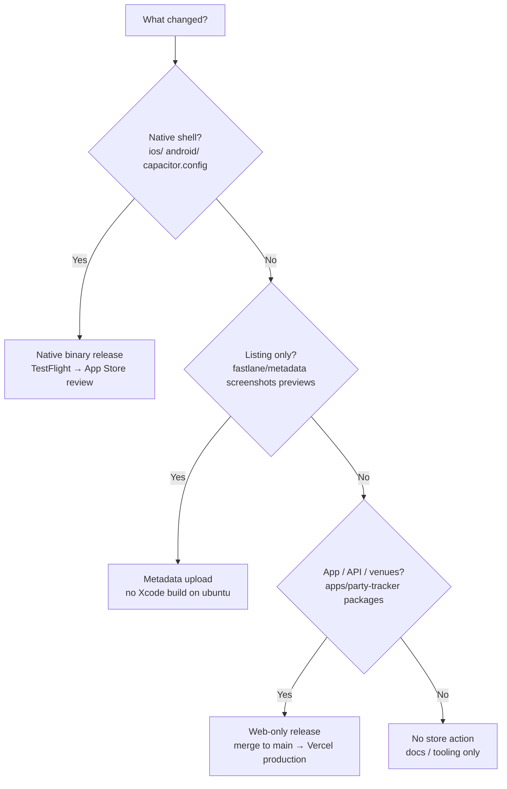

# Store releases — web vs metadata vs native

[← Guide index](index.md) · [Fastlane](../../fastlane/README.md) · [ADR-0005](../adr/0005-store-capacitor-shell.md)

Park Bound ships as a **Capacitor shell** whose WebView loads **`https://parkbound.kurat0r.ai`** ([`capacitor.config.json`](../../capacitor.config.json)). Most product work reaches App Store users **without** a new binary or Apple review. Reserve store uploads for native shell changes.

## Quick decision



Classify your branch automatically:

```bash
npm run store:release-plan
npm run store:release-plan -- --base origin/main
```

Path rules live in [`scripts/lib/store-release-paths.json`](../../scripts/lib/store-release-paths.json).

## Three release tiers

| Tier | Apple / Google review? | Typical latency | How users get it |
|------|------------------------|-----------------|------------------|
| **Web-only** | No | Minutes (Vercel deploy after merge to `main`) | Capacitor app loads live origin on next open |
| **Metadata** | Light check on listing copy; **no new binary** | Hours (API upload) | App Store / Play listing text, screenshots, previews |
| **Native binary** | **Yes** — every App Store production version | ~1–3 days (variable) | New IPA/AAB via TestFlight or production track |

Apple does **not** offer a program to skip review for production App Store versions. Best practice here is to **minimize native releases**, not to chase a bypass.

## Web-only release (default)

Use for UI, party logic, API routes, venue data, bug fixes — anything under `apps/party-tracker/` or shared packages that deploy to Vercel.

### Checklist

- [ ] PR passes CI (`npm run test:pre-merge-vertical` when the diff touches app paths)
- [ ] Merge to **`main`** (production deploy — do **not** rely on Vercel preview branches; see [contributing.md](contributing.md#vercel-deploys))
- [ ] Confirm production: open `https://parkbound.kurat0r.ai` (or exercise the changed flow)
- [ ] Store app smoke: force-quit Park Bound on a device → reopen → verify the fix (WebView cache may delay by minutes; pull-to-refresh if applicable)

### Do not

- Bump `package.json` `version` in the PR — [version-on-merge](../../.cursor/rules/version-on-merge.mdc) bumps after merge when app paths change
- Submit a new IPA “just to ship” a web fix
- Add `[vercel build]` unless **you** explicitly want a preview deploy ([vercel-previews](../../.cursor/rules/vercel-previews.mdc))

## Metadata-only release

Use when listing copy, screenshots, App Previews, or age-rating config change — **no** native code or Capacitor plugin changes.

### Checklist

- [ ] Edit `fastlane/metadata/ios/en-US/` (and `fastlane/metadata/android/en-US/` for Play)
- [ ] Update `release_notes.txt` for the **App Store Connect version** that already exists (semver from `apps/party-tracker/package.json` after merge, or `IOS_APP_VERSION` repo variable)
- [ ] Regenerate art when UI changed: `npm run store:screenshots`, `npm run store:app-preview`
- [ ] Ensure `APP_STORE_REVIEW_PHONE` secret is set (required for iOS metadata upload)
- [ ] Upload:
  - **CI:** push to `main` (auto) or **Actions → iOS App Store metadata**
  - **Local:** `FASTLANE_METADATA_ONLY=true bundle exec fastlane ios metadata`

Promotional text and description can update without rebuilding the shell. This does **not** replace a binary when native code changed.

See [`fastlane/metadata/ios/SUBMISSION.md`](../../fastlane/metadata/ios/SUBMISSION.md) for the full Connect checklist.

## Native binary release

Use when the **store shell** changes: Capacitor plugins, `ios/` / `android/` project files, entitlements, push/location native config, `capacitor.config.json`, or Apple-mandated SDK bumps.

### Best practices (reduce review friction)

1. **Batch** native work — upload one IPA when several native changes have merged, not on every `main` bump.
2. **TestFlight first** — catch signing and native regressions before App Review.
3. **Manual release** — `IOS_AUTOMATIC_RELEASE=false` (Fastfile default): submit early, release when review passes. In Connect choose **Manually release this version**.
4. **Phased release** — in App Store Connect after approval, roll out gradually to production users.
5. **Expedited review** — only for critical production bugs; request in Connect, do not rely on it.
6. **Review notes** — keep `fastlane/metadata/ios/review_information/notes.txt` accurate (guest path, no demo password, location, IAP not in this binary).
7. **Routing coverage** — `fastlane/metadata/ios/routing_app_coverage.geojson` (one MultiPolygon). `npm run venues:reindex` after adding a venue; `npm run store:scaffold-metadata` also regenerates it.

### Checklist — beta (TestFlight)

- [ ] Native changes merged to `main`; semver bumped by merge workflow if app paths changed
- [ ] `npm run cap:sync` — stamps native marketing version from `apps/party-tracker/package.json`
- [ ] Device test: location, push, deep links / invites
- [ ] Upload:
  - **CI:** **Actions → Store binaries** → `ios` → track **`beta`** ([`.github/workflows/store.yml`](../../.github/workflows/store.yml))
  - **Local (macOS):** `bundle exec fastlane ios beta`
- [ ] Install from TestFlight; verify against production web origin

### Checklist — production (App Store / Play)

- [ ] TestFlight build validated
- [ ] `fastlane/metadata/ios/en-US/release_notes.txt` updated for this version
- [ ] App Store Connect version record exists matching `apps/party-tracker/package.json`
- [ ] Privacy URL, IAP product (do not attach until StoreKit ships), routing GeoJSON, and App Privacy questionnaire current — [`SUBMISSION.md`](../../fastlane/metadata/ios/SUBMISSION.md)
- [ ] Upload:
  - **CI:** **Actions → Store binaries** → `ios` or `both` → track **`production`**
  - **Local:** `bundle exec fastlane ios production`
- [ ] In Connect: submit for review → wait → **release manually** (or phased) when approved
- [ ] Android: same workflow with `android` / `both` (Play review is separate, usually faster)

### Environment flags (Fastfile)

| Variable | Default | Purpose |
|----------|---------|---------|
| `IOS_SUBMIT_FOR_REVIEW` | `true` | Set `false` to upload binary without submitting |
| `IOS_AUTOMATIC_RELEASE` | `false` | Keep **Manually release this version** after approval |
| `IOS_SKIP_METADATA` | `false` | Skip listing upload during production lane |
| `IOS_SKIP_SCREENSHOTS` | `true` | Set `false` when refreshing screenshots in production lane |

## Versioning

| Artifact | Source of truth |
|----------|-----------------|
| User-facing semver | `apps/party-tracker/package.json` (bumped on merge to `main` when app paths change) |
| iOS build number | Xcode / CI during archive |
| Android `versionCode` | Derived from semver in Fastfile (`major*10000 + minor*100 + patch`) |

Do **not** edit version stamp files in feature PRs. See [version-on-merge](../../.cursor/rules/version-on-merge.mdc).

**Release rhythm:** merge-driven web on every PR; store binary only when native paths change. See [release-cycle.md](release-cycle.md) and `npm run store:release-cycle`.

## Workflow map

| Goal | Automation |
|------|------------|
| Classify this branch | `npm run store:release-plan` |
| Current release mode | `npm run store:release-cycle` |
| Web production deploy | Merge PR to `main` → Vercel |
| iOS listing / previews only | [`ios-app-store-metadata.yml`](../../.github/workflows/ios-app-store-metadata.yml) |
| IPA / AAB upload | [`store.yml`](../../.github/workflows/store.yml) (manual `workflow_dispatch`) |
| Venue JSON in production | `npm run venues:build` in PR + merge (web tier) |
| Pre-merge validation | `npm run test:pre-merge-vertical` |

## What not to use for skipping review

| Approach | Verdict |
|----------|---------|
| Remote WebView URL (current architecture) | **Recommended** — ship web on Vercel |
| OTA JS bundles (CodePush, Capgo, etc.) | Risky — Apple Guideline 2.5.2; major features can be rejected |
| Enterprise distribution | Internal employees only — not for public App Store |
| Metadata upload | Listing only — does not update native code |

## First-time / annual tasks

- [ ] Apple Small Business Program enrolled (15% commission) — see [`SUBMISSION.md`](../../fastlane/metadata/ios/SUBMISSION.md)
- [ ] Paid Apps Agreement active before IAP
- [ ] Rotate App Store Connect API key and Play service account on schedule — [`fastlane/README.md`](../../fastlane/README.md#security)

---
[← Guide index](index.md) · [Fastlane](../../fastlane/README.md)
