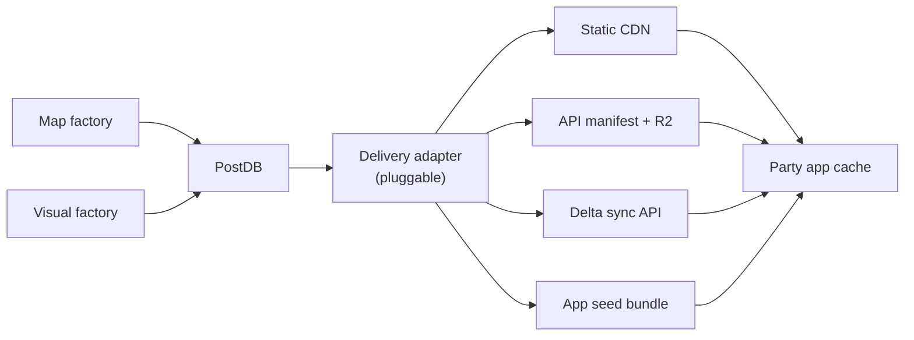
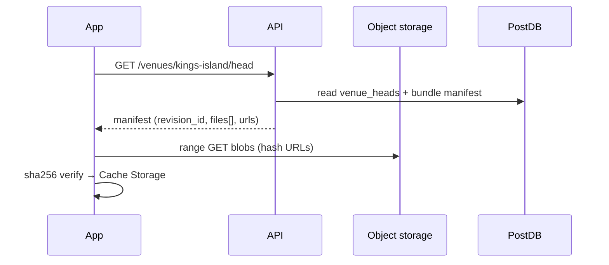

# Factory industry comparison — Map factory, Visual factory, PostDB, delivery

**Date:** 2026-08-24  
**Status:** Research (grill session input)  
**Owner decisions:** PostDB is canonical for factory outputs; **how the app is served is open** to better methods than today's `public/venues/` static files.

**Sources:** Notion workflow template, Postgres type guide, Overture GERS, OpenPOIs, MapLibre/PMTiles ecosystem, repo ADRs, `packages/venue-builder/` as-built.

---

## Architecture layers (updated)

| Layer | Locked? | Role |
| --- | --- | --- |
| **Map factory** | Product shape locked | Evidence-based truth: geometry, Places, Gaps |
| **Visual factory** | Product shape locked | Display packs, skins, tiles, certs — never repositions |
| **PostDB** | **Locked (owner)** | Canonical store for all factory outputs |
| **Delivery** | **Open** | How bytes reach the phone — not tied to git `public/` |
| **Phone contract** | Locked | Offline-capable, integrity-verified, truth/display split |

**What must survive any delivery change:** hash-addressed manifest, `basedOn` / revision pin, adopt-unchanged-bytes, no half-committed sync (see `apps/party-tracker/lib/venue/download.js`).

---

## Map factory — industry vs Park Bound

### What mature GIS pipelines do

| Pattern | Who | Steal? |
| --- | --- | --- |
| **Stable entity IDs + bridge files** | [Overture GERS](https://docs.overturemaps.org/gers/) | Yes — `canonical_place_id` registry, adapter→place bridge table in PostDB |
| **Changelog-driven incremental rebuild** | Overture monthly releases | Yes — rebuild only venues touched by changed evidence |
| **POI conflation with confidence** | [OpenPOIs](https://github.com/henryspatialanalysis/OpenPOIs) | Yes — confidence score per Place claim, not binary merge |
| **OSM merge/dedupe** | [@osmix/change](https://github.com/conveyal/osmix) | Yes — adapter reconciliation before truth publish |
| **OSM → Postgres topics** | [pgosm-themepark](https://github.com/travishathaway/pgosm-themepark) | Partial — park-relevant OSM layers only during build |
| **Profile before clean** | Palantir / Notion Stage 4 | Yes — adapter profiling gates transforms |
| **Expectations abort build** | dbt tests, Overture | Yes — cert failures block publish head move |
| **PostGIS spatial ops** | Industry default | Yes **in factory**, not on phone |

### Where Park Bound legitimately diverges

| Divergence | Why it's correct |
| --- | --- |
| **Attraction = multi-slot entity**, not point POI | Queue/station/exit are product truth |
| **Gaps as first-class output** | Honest unknowns beat silent conflation |
| **Human certification gate** | Theme parks need steward sign-off, not auto-merge |
| **Single-venue scope** | Not planet-scale Overture; per-World truth |
| **Evidence graph + agents** | Park-specific adapters > generic GERS-only |
| **No live PostGIS on phone** | Offline JSON/PMTiles at runtime (ADR-0013) |

### Improve (steal and do better)

1. **GERS-like IDs for Places** — string `id` per Place, bridge table `place_aliases(source, external_id, canonical_id)`; fuzzy matches → gap queue, never silent merge (Notion Stage 4.5).
2. **Revision changelog** — `truth_revisions` + `revision_changes` view; Map factory rebuilds only affected venues (Overture changelog pattern).
3. **OpenPOIs-style confidence** on evidence claims — already have `evidence-graph.mjs`; persist scores in PostDB, surface in certify UI.
4. **@osmix/change** for OSM adapter patches — merge park extract + operator overrides with dedupe before evidence engine.
5. **PostGIS in PostDB** for build-time only — `ST_*` on geometry columns for adapter spatial joins; export still jsonb/GeoJSON for phone.
6. **Kart-style geo versioning** — PostDB append-only revisions subsume Kart for v1; revisit if branch-per-venue editing needed.

### Irrelevant (skip)

- [Hootenanny](https://github.com/ngageoint/hootenanny) planet-scale ML conflation
- Full Overture six-theme enterprise ontology
- WMS/WFS / ArcGIS Server runtime
- Indoor BIM/IFC (unless a specific venue demands it later)
- Real-time streaming ingest to phones
- H3/S2 global indexing (venue bounds are tiny)

---

## Visual factory — industry vs Park Bound

### What mature display pipelines do

| Pattern | Who | Steal? |
| --- | --- | --- |
| **Style ↔ tile schema contract** | [vector-tile.com CI guides](https://www.vector-tile.com/map-styling-layer-synchronization/) | Yes — schema fixture JSON from Tippecanoe build |
| **Content-hash versioned tiles** | Mapbox/MapLibre CI | Yes — `/tiles/{hash}/…` never overwrite in place |
| **Style lint in CI** | [navidnabavi/styl](https://github.com/navidnabavi/styl) | Yes — `styl check` on every `*.style.json` |
| **PMTiles single archive** | [Protomaps](https://docs.protomaps.com/pmtiles) | **Already using** — keep |
| **Additive publish** | Industry CI | Yes — publish tiles before style pointer update |
| **Maputnik** | MapLibre | Optional steward UI for style JSON |
| **Reference profile contract** | ADR-0014 | **Already have** — extend to PostDB |

### Where Park Bound legitimately diverges

| Divergence | Why it's correct |
| --- | --- |
| **Per-venue display packs**, not one global basemap | Each World has its own art + grounding |
| **Skin template × venue `visual.json`** | Profile cosmetics × World overrides |
| **3 zoom bands with authored content** | Not just magnification (ADR-0019/0021) |
| **Baked world PNGs + game-tier refs** | ADR-0014 reference profiles, not Mapbox defaults |
| **Grounding harvest from imagery** | ADR-0020 — material relationships, not recolor |
| **Display certify at fixed cameras** | Perceptual gate, not just schema lint |
| **Truth/display split** | Industry often fuses them; you must not |

### Improve (steal and do better)

1. **Schema fixture** — Tippecanoe emits `display-schema.json`; Visual factory + `styl` validate styles against it in CI.
2. **Immutable blob store** — `artifact_blobs.sha256` as URL path; delivery serves by hash not venue slug.
3. **Revision-aware display** — `display_packs.based_on_revision_id` FK replaces string `basedOn.map`.
4. **PMTiles ambient cache** — MapLibre Native PR #4290 (2026) — range cache now viable; verify on target Capacitor build.
5. **Quantization ladder** for large worlds — binary/halfvec not needed for maps; but **preview → full** tile LOD in bundle manifest.

### Irrelevant (skip)

- Mapbox Studio cloud hosting / Styles API as runtime dependency
- Live Martin/pg_tileserv on phone
- Tangram, legacy Mapbox GL v1 patterns
- Per-venue React/CSS forks (ADR-0013 non-goal)
- Full Unity/Unreal scene export per park
- Stadia/Thunderforest commercial tile hosting

---

## PostDB — industry vs proposal

| Industry | Park Bound postdb | Verdict |
| --- | --- | --- |
| PostGIS geometry columns | jsonb truth bodies v1 | **Add PostGIS for build queries in Slice 2** |
| Immutable revisions + head pointer | `truth_revisions` + `venue_heads` | Correct — matches event sourcing |
| jsonb for sparse metadata | cert bodies, run opts | Correct — promote hot columns |
| S3/R2 for large blobs | `artifact_blobs.storage_uri` | Correct — hybrid per Notion TOAST guidance |
| Kart / geo git | append-only revisions | postdb sufficient v1 |
| pg_tileserv live serving | export to PMTiles | **Do not** serve live tiles from PostDB to phone |

---

## Delivery — open to better methods

Today's path: factory → git `public/venues/` → Vercel CDN → download manager → Cache Storage.

**Owner:** this path can change. **Invariant:** offline integrity contract in `download.js` (hash verify, atomic sync, manifest pin).

### Option matrix

| Option | How it works | vs today | Fit |
| --- | --- | --- | --- |
| **A — Static CDN (current)** | Export postdb → `public/` or R2; same URLs | Familiar; requires deploy or upload job | Good baseline |
| **B — API manifest + object storage** | `GET /api/venues/:id/head` returns manifest + signed URLs to R2 blobs | **No app redeploy** for data updates; postdb export async | **Recommended** |
| **C — Single venue archive** | One `.zip` or `.tar` per revision (truth + display) | Simpler phone sync; harder partial updates | Good for first visit |
| **D — Delta sync API** | `GET /api/venues/:id/delta?since=<revision_id>` | Minimal bandwidth; needs server diff | Slice 3+ |
| **E — Capacitor Background Sync** | OS-scheduled manifest check | Better battery; same bytes underneath | Complements B/D |
| **F — Live PostDB/API tiles** | Phone queries API per tile | Low offline; violates product | **Reject** |
| **G — Peer/party mesh sync** | Host shares venue pack | Interesting for Party; not v1 | Future |

### Recommended delivery architecture (postdb era)

**Steal from:**
- Protomaps/R2 pattern — immutable hash paths, range requests
- Game asset CDNs — manifest + delta patches
- npm/cargo registries — content-addressed artifacts

**Keep from today:**
- `planBundleSync` / `syncVenueBundle` logic — swap URL source, not integrity rules
- Service worker hash gate (`sw.js`)
- Seed flagship venues in app install (bootstrap offline)

**ADR-0018 amendments needed:**
- Clause 1: postdb is the bus (not git)
- Clause 5: publication is **export to delivery store**, not necessarily `public/` in repo
- Revisit rejected "separate object-storage publish job" — **now in scope** as delivery adapter

---

## Grill frontier — delivery (new)

**Q20 — Delivery authority:** Does the phone fetch manifests from **API** (postdb head) with blobs on **R2**, or stay on **same-origin static** until fleet scale demands R2?

➡️ Recommend: API manifest + R2 blobs when postdb lands; keep seed bundles in app. Same-origin OK for dev.

**Q21 — Export trigger:** Postdb head moves on certify — export runs **automatically** (job) or **steward publish** action?

➡️ Recommend: automatic export to staging; steward promotes head to production channel (like Mapbox tile publish).

**Q22 — Partial vs full bundle:** Phone downloads **full venue bundle** per revision or **per-file delta** from last `revision_id`?

➡️ Recommend: full bundle v1 (existing manifest model); delta API when average venue > 15 MB.

---

## Theft shortlist (implementable slices)

| Priority | Steal from | Into |
| --- | --- | --- |
| P0 | PostDB revision + FK `based_on` | `db/migrations/004_postdb_*.sql` |
| P0 | Hash-addressed blob URLs | delivery export + download manager URL source |
| P1 | Overture bridge-file pattern | `place_aliases` + adapter bridge table |
| P1 | styl CI | `styl check` on display styles |
| P1 | Tippecanoe schema fixture | `display-schema.json` gate |
| P2 | OpenPOIs confidence | evidence claim scores in PostDB |
| P2 | @osmix/change | OSM adapter merge stage |
| P2 | Overture changelog | incremental Map factory rebuild |
| P3 | API manifest + R2 | replace git `public/` publish path |

---

## References

- [Overture GERS](https://docs.overturemaps.org/gers/)
- [OpenPOIs](https://github.com/henryspatialanalysis/OpenPOIs)
- [conveyal/osmix](https://github.com/conveyal/osmix)
- [navidnabavi/styl](https://github.com/navidnabavi/styl)
- [Protomaps PMTiles](https://docs.protomaps.com/pmtiles)
- [vector-tile.com CI/CD tile automation](https://www.vector-tile.com/automated-generation-pipelines-with-tippecanoe/ci-cd-tile-build-automation/)
- [ThemeParks.wiki parksapi](https://github.com/kateamllc/parksapi)
- [pgosm-themepark](https://github.com/travishathaway/pgosm-themepark)
- Repo: ADR-0013, 0014, 0018, 0019, 0020, 0021; `venue/download.js`, `venue-bundle.mjs`
