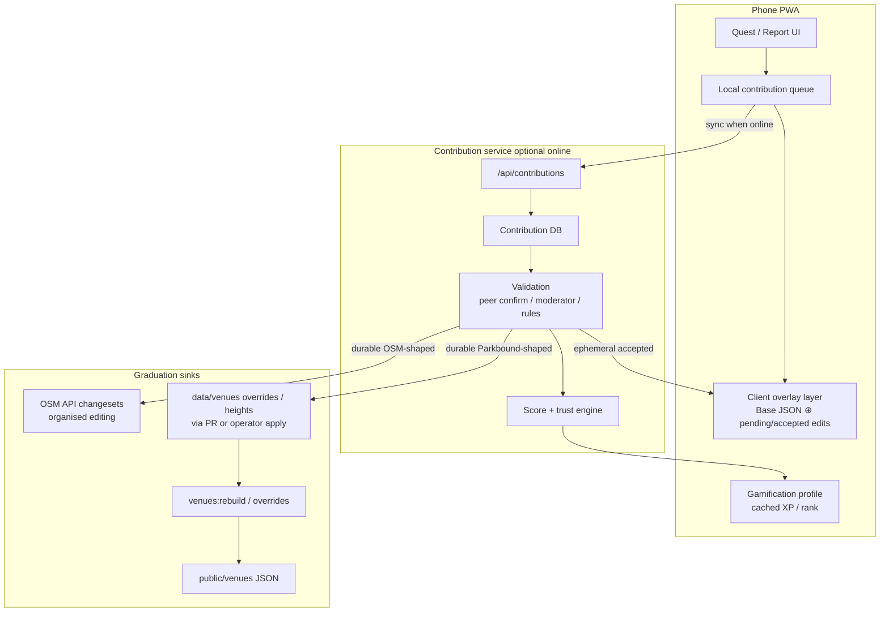

# Design: Gamified map contributions for Parkbound (“Waze for the park”)

**Date:** 2026-08-10  
**Status:** Draft for review — not approved for implementation  
**Master plan:** [`./2026-08-10-park-bound-master-spec.md`](./2026-08-10-park-bound-master-spec.md) · backlog epic **E9–E11** in [`./park-bound-implementation-backlog.md`](./park-bound-implementation-backlog.md)  
**Companion research:** [`../../research/2026-08-10-gamified-map-contributions.md`](../../research/2026-08-10-gamified-map-contributions.md)

---

## Problem

Park maps drift: restrooms close, paths get mis-tagged, heights are wrong, rides go down, OSM is incomplete inside the fence. Parkbound already builds venues from OSM + hand overrides, but **park guests cannot improve the live experience for others** and get nothing for helping. We want a Waze-like loop: notice → report/fix → others benefit → reporter earns score and privileges.

## Goals

1. Guests can improve **accuracy** (map/POI facts) and **experience** (live ops signals) for other guests.
2. Contributors earn **scores and rewards** tied to verified helpfulness.
3. Durable fixes can reach **OpenStreetMap** and/or Parkbound’s **central contribution / venue pipeline** without violating the builder ↔ app contract or offline-first premise.
4. Bad or gamed contributions do not silently corrupt shipped venues.

## Non-goals (v1)

- Full freeform OSM geometry editor in the PWA.
- Mandatory accounts for using the map or party features.
- Redeemable cash / gift-card economy.
- Replacing the venue builder with a live PostGIS runtime on phones.

## Constraints (from existing product)

- Offline map draw stays service-worker / JSON based.
- Only the builder may write `public/venues/*.json` and `lib/venueIndex.js`.
- Hand corrections for a venue live in `data/venues/<id>.*` then rebuild.
- Party mesh is already the social unit; contributions should optionally amplify party value without requiring a global identity for basic park use.

---

## Approaches considered

### A — Direct-to-OSM (StreetComplete-in-Parkbound)

Phone quests write OSM changesets via user OAuth immediately.

| Pros | Cons |
|------|------|
| Improves the global commons | Organised Editing compliance + OAuth UX |
| No Parkbound “second map” | OSM has no pre-moderation; park vandalism risk |
| Aligns with OSM ethos | Ephemeral ops (ride down) do not belong in OSM |
| | Offline conflict resolution is hard; scoring needs a side store anyway |

### B — Central contribution store + overlay, graduate outward (**recommended**)

Phone submits structured contributions to a Parkbound contribution service (with local queue). Overlays update the app quickly. Confirmed durable edits export to OSM and/or open PRs / patches into `data/venues/<id>.overrides.json` (then rebuild).

| Pros | Cons |
|------|------|
| Fits Base ⊕ edits + builder contract | New backend + identity for scoring |
| Separates ephemeral vs durable cleanly | Must design export carefully (OSM + Git) |
| Can ship value before OSM policy work | Two-hop latency to “canonical” map |
| Enables peer confirm like Waze | |

### C — Private map only (Waze proprietary)

All truth lives in Parkbound’s DB; OSM is read-only import forever.

| Pros | Cons |
|------|------|
| Full control of QA and scoring | Diverges from OSM; duplicates maintenance |
| Simpler policy | Against “build anywhere OSM covers” story |
| | Community goodwill / mapper recruitment weaker |

**Recommendation: B.** It matches research (Wayfarer review gates + Waze confirm loops + StreetComplete quest UX) and Parkbound’s architecture review (human validation + Base ⊕ edits, no PostGIS-on-phone).

---

## Design overview



### Core principle

**Ship overlays fast; graduate slowly.** Users feel impact in minutes. Canonical OSM / builder artifacts update after trust thresholds.

---

## Contribution taxonomy

### Tier 1 — Experience signals (ephemeral, Waze-like)

TTL hours or until contradicted. Never written to OSM as permanent map fact.

| Type | Example | Default TTL | Confirm action |
|------|---------|-------------|----------------|
| `ride_status` | Down / delayed / boarding | park day | Still down? / Running |
| `queue_band` | Short / medium / long | 30–90 min | Agree / higher / lower |
| `amenity_outage` | Restroom closed, fountain dry | park day | Still closed? |
| `crowd_hotspot` | Midway packed | 30–60 min | Still packed? |
| `hazard` | Spill, blocked path | until clear | Cleared |

### Tier 2 — Accuracy quests (durable candidates)

StreetComplete-style single questions, GPS-gated.

| Type | Example | Graduation path |
|------|---------|-----------------|
| `poi_presence` | Missing water fountain here | OSM node and/or overrides.add |
| `poi_attribute` | Cuisine, opening hours, wheelchair | OSM tags |
| `height_rule` | Min height / companion | `heights.json` / overrides (Parkbound-first) |
| `path_attribute` | Stairs, stroller-hostile | OSM tags when confident |
| `name_fix` | Wrong ride label | OSM + overrides alias |
| `geometry_nudge` | Entrance pin off by >N m | Moderator / trusted editor only |

### Tier 3 — Expert / power-user

Unlocked by rank: batch MapRoulette-like tasks for a venue, conflict resolution, export review.

---

## Gamification model

### Motivation stack (design from drives, not decoration)

| Drive | Mechanic |
|-------|----------|
| Epic meaning | “You unblocked 14 parties from a wrong height rule” + thanks |
| Achievement | XP, ranks, quest streaks (careful with streaks offline) |
| Social | Party shout-outs; public thank on confirm; per-venue weekly league |
| Ownership / power | Higher ranks unlock more quest types and review weight |
| Scarcity / loss | Soft: seasonal venue badges; avoid punitive point decay |

### Point types (SAPS + Odobašić)

1. **Experience (XP)** — permanent progress metric; never spent.
2. **Reputation** — trust weight derived from agreement rate + tenure + proximity honesty checks.
3. **Karma** — earned by confirming/denying others (Waze “There / Not there”).
4. **Access / Power** — rank gates (not a spendable currency).
5. **Stuff** — deferred; optional partner park perks later.

### Suggested XP table (v1 draft)

| Action | Provisional XP | Confirmed XP (replaces / adds) |
|--------|----------------|--------------------------------|
| Submit Tier-1 report | +2 | +6 when ≥2 unique confirms or 1 trusted |
| Confirm / deny others | +2 | +2 (always, rate-limited) |
| Submit Tier-2 quest answer | +3 | +12 when accepted |
| Photo attached (optional) | +1 | +3 if used in accept |
| First helpful contribution of day | +5 bonus | — |
| False report overturned | −10 reputation, XP clawback | |

**Rule:** never award full durable-edit XP on bare submit. Wayfarer’s “approved nomination” pattern.

### Ranks (Power ladder)

| Rank | Rough XP | Unlocks |
|------|----------|---------|
| Guest | 0 | View map; optional anonymous local notes (no global score) |
| Scout | 50 | Tier-1 reports with account; appear on venue board |
| Ranger | 250 | Tier-2 quests; karma confirms count double weight |
| Cartographer | 1000 | Height/path quests; nominate OSM export |
| Steward | invite / high reputation | Review queue; temporary mute; organised OSM edits |

Anonymous use remains first-class for navigation/party. Scoring requires a lightweight identity (device-backed account or OAuth).

### Leaderboards

- Default: **this venue, this week**.
- Secondary: personal best / party combined “map care” score.
- Avoid all-time global boards as the primary surface.

### Rewards beyond points

- Status: badge on party avatar (“Ranger · Kings Island”).
- Access: early quest packs for new venues.
- Power: review weight and edit surface.
- Meaning: achievement copy that teaches *why* the data helps (StreetComplete link-collection pattern adapted to Parkbound tips).

---

## Validation & anti-abuse

1. **GPS proximity** — Tier-1/2 submissions require recent location near target (with explicit override for known GPS failure indoors, reduced trust).
2. **Rate limits** — per hour / per POI; Waze-like dedupe of repeat edits.
3. **Peer confirmation** — ephemeral facts need N independent confirms; denials decay trust.
4. **Reputation-weighted voting** — Stewards > Rangers > Scouts.
5. **Delayed full credit** — provisional overlay, confirmed score later.
6. **Audit log** — contribution id, actor, target entity id, payload, evidence photo hash, outcome.
7. **No silent write to generated venue JSON** — exports go through overrides/OSM/rebuild.

---

## Data model (logical)

```text
Contributor { id, displayName, xp, reputation, rank, venueStats[] }
Contribution {
  id, venueId, entityId?, type, payload, status,
  createdAt, expiresAt?, latlng?, accuracyM?,
  authorId, confirmations[], denials[],
  graduation: none | overlay | osm | overrides
}
Confirmation { contributionId, authorId, vote, createdAt, latlng? }
ScoreEvent { id, authorId, contributionId?, deltaXp, deltaRep, reason, createdAt }
```

Entity ids must be stable venue place ids (`i` / slug) so Base ⊕ edits do not lose user work on rebuild (see park-intelligence-review).

### Client overlay merge

```text
visiblePlace = baseVenueJSON ⊕ acceptedRemoteEdits ⊕ pendingLocalQueue
```

Conflict strategy (declared): hand/steward override > confirmed contribution > base builder output > pending local.

---

## OSM graduation (phase 2+)

When a durable contribution is accepted and tagged `graduation: osm`:

1. Ensure Organised Editing wiki page + changeset hashtag (e.g. `#parkbound`).
2. Prefer **user’s OSM OAuth** for the changeset; Parkbound server only assists packaging.
3. Quest payloads map to a small allowlisted tag set (no freeform tag soup).
4. Changeset comment: human summary + hashtag + contribution id URL.
5. Monitor via OSMCha filters on hashtag; Steward cleanup queue.

Height rules and park-policy facts that OSM does not model stay on the **overrides** path.

---

## UX sketch

1. **Map long-press / place sheet → “Improve this”** — opens quest chooser filtered by place type.
2. **Ambient quest pins** (optional toggle) — StreetComplete-style nearby gaps (“Height unknown”, “Wheelchair?”).
3. **Report tray** (Waze button analogue) — one-tap Tier-1 while navigating.
4. **Thanks toast** when someone confirms your report.
5. **Profile** — XP, rank, weekly venue standing, recent contributions.

Keep first-viewport / brand rules of the main app intact; contribution UI lives in place sheets and a dedicated “Scout” tab, not the hero.

---

## Phased delivery

### Phase 0 — Spec alignment

- Approve this design; decide identity provider; confirm Notion notes after MCP auth.

### Phase 1 — Local + party value (minimal server)

- Contribution queue on device.
- Tier-1 ride/amenity reports shared on party mesh (action-log style).
- Local XP ledger (not global).
- Proves UX without committing to OSM.

### Phase 2 — Central store + scoring

- Accounts, contribution API, confirmations, venue weekly boards.
- Overlays fetched when online; cached for offline.
- Rank gates for Tier-2.

### Phase 3 — Builder graduation

- Operator tooling / automated PR drafts into `data/venues/<id>.overrides.json` or heights.
- `venues:overrides` / rebuild pipeline unchanged as sole publisher of public JSON.

### Phase 4 — OSM graduation

- Organised Editing compliance, OAuth, allowlisted quests → changesets.
- Steward review UI.

---

## Testing strategy

- Unit: score transitions, clawbacks, merge precedence, TTL expiry.
- Functional: offline queue → sync; overlay visible without network after sync once.
- Abuse: rate limit, proximity rejection, double-confirm same device.
- Contract: no test writes `public/venues` except via builder scripts.
- Visual: place sheet “Improve” and report tray on one venue.

---

## Open decisions (need product call)

1. Is global identity required in Phase 1, or is party-local scoring enough to start?
2. Should height rules ever export to OSM, or always stay Parkbound overrides?
3. Photo storage: required for Tier-2, optional, or notes-only?
4. Partner “stuff” rewards with parks — in or out of scope for year one?

---

## Success metrics

- % of sessions with ≥1 confirm or report (without hurting core nav).
- Median time from report → first peer confirm.
- Agreement rate (confirms / (confirms+denials)) by rank.
- Graduated overrides/OSM edits accepted vs reverted.
- Retention of Scouts to Ranger within 3 park visits.

---

## Spec self-review notes

- No TBDs left without an owning “Open decision.”
- Approach B is explicit vs A/C.
- Scope is multi-phase: implement Phase 1 only after approval; later phases get their own implementation plans.
- Ambiguity on identity deferred to open decision #1 rather than silently assuming accounts.
