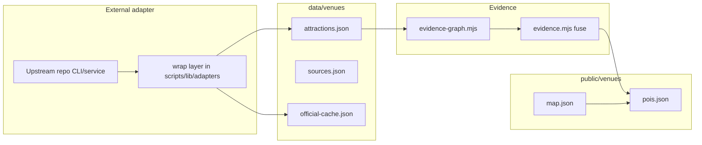

# Universal Venue Builder — adapter architecture

How external open-source projects attach to the venue builder **without** forking them
into this monorepo or breaking the offline-first phone app.

Related: [dependency matrix](./universal-venue-builder-dependency-matrix.md) ·
[park intelligence review](./park-intelligence-review.md)

## Two runtimes

| Runtime | Truth | Constraints |
| --- | --- | --- |
| **Builder** (Node scripts, optional Python/GPU workers) | Sidecars in `data/venues/`, fused output in `public/venues/` | Network OK; may call Overpass, browsers, CV |
| **Phone** (PWA) | `map.json` + `pois.json` precached | No required server; five production npm deps |

Adapters live in the **builder** world. Their job is to produce **claims** the evidence
engine can fuse. The phone never imports LangGraph, Valhalla, or YOLO.

**External research path:** `sources.json` `datasets.external` selects adapters.
`npm run venues:sync-sources` / research agent caches them under `data/venues/<id>.*-cache.json`.
`external-claims.mjs` binds ParksAPI locations and Mapillary/a11y points to rides;
`attractions` inventory feeds matched entrance claims through `addEvidence`.
Queue-Times, RopeDrop, Open-Meteo, and RCDB stay inventory/QA — they do not invent
wait times or height rules in the shipped bundle.

**Official pages + LLM open research:** `open-research.mjs` always runs deterministic
pairing from the official-site cache (heights/aliases/inventory gaps). With `--ai` /
`VENUE_LLM_API_KEY`, an LLM may propose additional aliases and height *candidates*
quoted from official text. LLM output is never coordinates and never auto-writes
heights; weight `llm_extract` alone cannot clear the publish floor.

## Adapter contract



**Descriptor** — static metadata in `registry.mjs` (license, stage, adopt mode).  
**Run** — optional `async run(ctx)` returning `EvidenceClaim[]` and artifact paths.  
**Stub default** — registered for evaluation with `error: not_implemented`.

Inspect registry: `npm run venues:adapters`

## Orchestration (LangGraph)

Long-running build workflows map cleanly to agent nodes:

```
VENUE BUILD
     │
     ▼
┌─────────────┐
│ ORCHESTRATOR│  LangGraph (wrap)
└──────┬──────┘
       │
       ├── Research Agent   → Playwright + LangChain tools
       ├── GIS Agent        → OSM / Overpass / Osmium
       ├── Vision Agent     → Mapillary / SAM2 / YOLO*
       ├── Data Agent       → ParksAPI metadata
       ├── Validation Agent → human UI + convergence report
       └── QA Agent         → venue-audit weaknesses
```

`*` YOLO only after license review.

Today: `venue-requests.mjs` briefs humans; `venue-research.mjs` and `venue-audit.mjs`
are the manual orchestration layer. LangGraph replaces **coordination**, not the
evidence rules.

## Geospatial foundation (OSM)

Already implemented:

- `build-venue.mjs` — Overpass → layers
- `osm-tags.mjs` — tag → layer/category
- `geometry.mjs` — clip, simplify, centroid

Extensions via wrap:

- **Osmium** — regional extracts when Overpass mirrors are too slow or CI must be air-gapped
- **Nominatim** — self-hosted place resolution matching `--refresh-place` semantics

Initial venue skeleton queries: attractions, buildings, footways, paths, entrances,
barriers, restrooms, restaurants, parking, gates.

## Routing: builder vs phone

| Layer | Technology | Purpose |
| --- | --- | --- |
| Phone | `lib/routing.js` A* | Turn-by-turn in queue line, ~1.8 ms |
| Builder QA | Valhalla or GraphHopper (evaluate) | Validate path graph connectivity, isochrones |

Theme parks are pedestrian graphs, not road networks. Any wrapped routing engine must
consume the **venue path layer**, not raw OSM highways alone.

## Map delivery: SVG today, tiles optional

Current: `ParkMap.jsx` renders SVG from full geometry in `map.json` — zero map deps,
works offline.

Optional pipeline for very large venues:

```
build-venue → GeoJSON layers → Tippecanoe → vector tiles → MapLibre (evaluate)
```

Adopt MapLibre only if tile size and styling beat SVG maintenance cost.

## Vision pipeline

```
Imagery (Mapillary / aerial / guest video)
        ↓
   Detection (YOLO*) or Segmentation (SAM 2)
        ↓
   Polygon or point + class label
        ↓
   Georeference (georef.mjs / control points)
        ↓
   Evidence claim (cv_detection / cv_segmentation / mapillary)
        ↓
   evidence-graph convergence report
```

OpenSfM is Phase 3 — multi-view 3D for stations and queue structures.

## Theme-park operational data

`cubehouse/themeparks` → study model; **ParksAPI** as wrap target.

Use for sidecar metadata:

- park identification
- attraction inventories
- operating hours concepts
- wait-time **acquisition patterns** (not live feed on phone until observation log exists)

Evidence key: `parks_api` (weight 3).

## Evidence graph vs fusion

| Module | Role |
| --- | --- |
| `evidence.mjs` | Weights, fuse(), publish bands, dissent |
| `evidence-graph.mjs` | Per-feature nodes, convergence summaries |
| `attractions.json` | Sidecar storage — never shipped to client |

Published output: coordinates + confidence band in `pois.json` only when
`atLeast(band, PUBLISH_AT)`.

## Capability matrix linkage

`scripts/lib/park-capabilities.mjs` maps audit **weaknesses** to tools. New rows point
maintainers at adapters and docs when audits flag gaps.

## Directory layout

```
scripts/
  venue-adapters.mjs          CLI
  lib/
    adapters/
      types.mjs               contract
      registry.mjs            dependency matrix (code)
      index.mjs
    evidence.mjs              fusion weights
    evidence-graph.mjs        graph + convergence
docs/
  universal-venue-builder-dependency-matrix.md
  universal-venue-builder-architecture.md   (this file)
```

## Principles

1. **Wrap, don't fork** — upstream stays upstream; adapters document invoke paths.
2. **Evidence, not guesses** — adapters emit sourced claims; fusion decides publish.
3. **Phone stays lean** — builder tools never become `dependencies` in package.json.
4. **Reject server-centric runtime** — databases and routing servers don't replace JSON + SW.
5. **License before embed** — AGPL (YOLO) gets `evaluate` + `commercial_ok: false` until decided.
